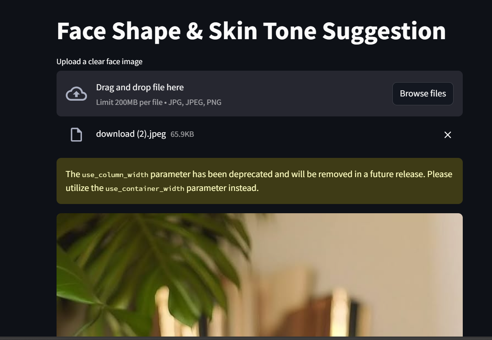

# Hairstyle and Makeup Suggestion App

This is a Streamlit web application that detects your **face shape** and **skin tone** from a face image you upload, then provides personalized **makeup**, **hairstyle**, and **skincare** suggestions based on the detected features.

## Features
- **Face Detection & Landmark Extraction:** Uses MediaPipe to detect facial landmarks.
- **Face Shape Classification:** Estimates face shape (Oval, Round, Square, Heart) using landmark geometry.
- **Skin Tone Classification:** Analyzes skin color from the cheek area and classifies it into Light, Medium, or Dark tones.
- **Personalized Suggestions:** Provides tailored beauty and skincare advice based on your face shape and skin tone.
- **Easy to Use:** Simple image upload interface using Streamlit, no webcam or extra hardware required.

## Usage
- Upload a clear frontal face image.
- The app automatically detects your face shape and skin tone.
- View your customized makeup, hairstyle, and skincare suggestions instantly.

## Technologies Used
- Python
- Streamlit (for UI)
- MediaPipe (for face landmark detection)
- OpenCV & NumPy (for image processing)

## How to Run Locally
1. Clone the repo.
2. Install dependencies via `pip install -r requirements.txt`.
3. Run the app with `streamlit run app.py`.
4. Open the displayed local URL in your browser.

## Deployment
This app can be deployed easily on [Streamlit Cloud](https://streamlit.io/cloud) or other cloud platforms.

---

Feel free to customize and improve the face shape detection and suggestions!

---

## 💻 App Screenshot

